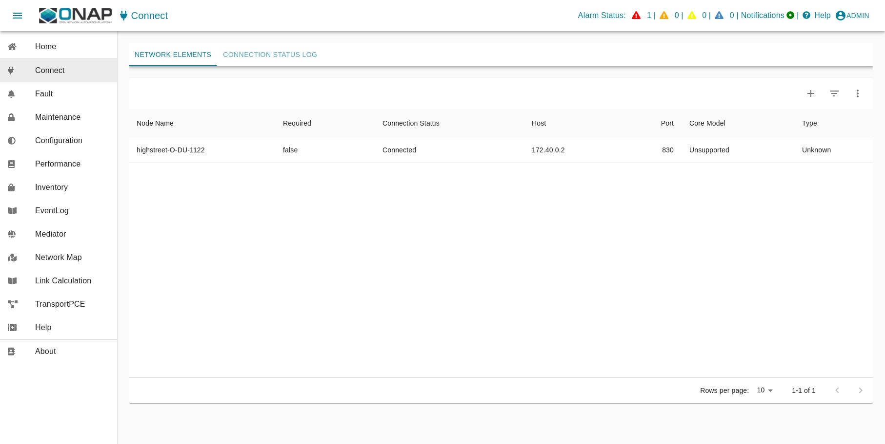

.. This work is licensed under a Creative Commons Attribution 4.0 International License.
.. SPDX-License-Identifier: CC-BY-4.0
.. Copyright (C) 2025 highstreet technologies USA Corp.

Service Management and Orchestration (SMO) OAM Deployment and Configuration
===========================================================================

This document focuses on a docker-compose deployment solution for SMO/OAM
Components. Such deployment should be used for research and development.

Introduction
------------

With respect to Operation and Maintenance (OAM), the SMO implements the
O1-interface and OpenFronthaul Management-Plane consumers. According to
the O-RAN OAM Architecture and the O-RAN OAM Interface Specification, the
SMO implements a NETCONF Client for configuration and a HTTP/REST/VES
server for receiving all kinds of events in VES format.

The O-RAN-SC OAM deployment contains an OpenDaylight-based NETCONF
client and an ONAP VES Collector. Kafka is used as a message router for
communication between the components. The Keycloak implementation offers
an Identity service, while traefik acts as a reverse proxy to terminate
all incoming https traffic. For storing data in a persistent way, the
implementation of the mariaDB project is used.

SMO OAM Components
------------------

This docker-compose file starts a pre-configured, self-contained SDN-R
solution with the following components:

- **Identity**  
  ... representing a Keycloak-based identity service for centralized
  user management. Please note that the implementation does not support
  IPv6. Therefore, its own network is required called ``DMZ``.

- **Controller** single node instance  
  ... representing the NETCONF consumer on the Service Management and
  Orchestration framework (SMO) for O-RAN O1 interface and/or O-RAN
  OpenFronthaul Management Plane and/or other NETCONF/YANG schemas
  implemented by the OpenDaylight project.

- **VES collector**  
  ... representing the VES (REST) provider at SMO for all kinds of
  events.

- **Messages**  
  ... representing the SMO MessageRouter component, includes
  message-router.

- **Gateway**  
  ... representing a reverse proxy terminating TLS traffic (https,
  NETCONF).

Prerequisites
-------------

Resources
~~~~~~~~~

The solution was tested on a VM with:

- 4x Core
- 16 GBit RAM
- 50 Gbit Storage

Operating (HOST) System
~~~~~~~~~~~~~~~~~~~~~~~

.. code-block:: console

   $ cat /etc/os-release | grep PRETTY_NAME
   PRETTY_NAME="Ubuntu 24.04.1 LTS"

Docker
~~~~~~

.. code-block:: console

   $ docker --version
   Docker version 27.5.1, build 9f9e405

Docker configuration for IPv6
~~~~~~~~~~~~~~~~~~~~~~~~~~~~~

In case you prefer IPv6 support the docker configuration must be modified. 

Please see:
https://docs.docker.com/engine/daemon/ipv6/

1. Edit /etc/docker/daemon.json, set the ipv6 key to true and the 
   fixed-cidr-v6 key to your IPv6 subnet. In this example we are setting it to 2001:db8:1::/64.

.. code-block:: console

   {
   "registry-mirrors": [
         "https://nexus3.o-ran-sc.org:10002", 
         "https://nexus3.onap.org:10001"
   ],
   "log-driver": "json-file",
   "log-opts": {
      "max-size": "10m",
      "max-file": "3"
   },
   "ipv6": true,
   "fixed-cidr-v6": "2001:db8:1::/64"
   }

2. Reload the Docker configuration file.

.. code-block:: console

   $ systemctl reload docker

Docker Compose
~~~~~~~~~~~~~~

.. code-block:: console

   $ docker compose version
   Docker Compose version v2.32.4

GIT
~~~

.. code-block:: console

   $ git --version
   git version 2.43.0

Please clone the following repositories:
- https://gerrit.o-ran-sc.org/r/admin/repos/oam,general
- https://gerrit.o-ran-sc.org/r/admin/repos/sim/o1-ofhmp-interfaces,general

Python
~~~~~~

.. code-block:: console

   $ python3 --version
   Python 3.12.3

A python parser package is required:

.. code-block:: console

   python3 -m venv .oam
   source .oam/bin/activate
   pip3 install requirements.txt

ETC Host (DNS function)
~~~~~~~~~~~~~~~~~~~~~~~

Your local IP and your used interface are required. Use the following
script to modify all ``.env`` and other configuration files accordingly.
The script will find automatically the interface and its IP address to
the internet. You can check its usage with the option ``-h``:

.. code-block:: console

   python3 ./adopt_to_environment.py -h

Please run the script with your preferred fully qualified domain name
you would like to use in your browser address bar:

.. code-block:: console

   python3 ./adopt_to_environment.py -d <your-smo-fqdn>

You can revert the settings in the modified ``.env`` and configuration
files using the option ``-r``:

.. code-block:: console

   python3 ./adopt_to_environment.py -d <your-smo-fqdn> -r

It is beneficial (but not mandatory) to add the following line at the end
of your ``~/.bashrc`` file. It will suppress warnings when Python scripts
do not verify self-signed certificates for HTTPS communication.

.. code-block:: console

   export PYTHONWARNINGS="ignore:Unverified HTTPS request"

Please modify the ``/etc/hosts`` of your system or modify the DNS of your
environment:

- ``<your-system>``: hostname of the system where the browser is started
- ``<deployment-system-ipv4>``: IP address of the system where the solution
  will be deployed

.. code-block:: none

   $ cat /etc/hosts
   127.0.0.1                localhost
   127.0.1.1                <your-system>

   # SMO OAM development system
   <deployment-system-ipv4>               smo.o-ran-sc.org
   <deployment-system-ipv4>       gateway.smo.o-ran-sc.org
   <deployment-system-ipv4>       identity.smo.o-ran-sc.org
   <deployment-system-ipv4>       messages.smo.o-ran-sc.org
   <deployment-system-ipv4>   kafka-bridge.smo.o-ran-sc.org
   <deployment-system-ipv4>       kafka-ui.smo.o-ran-sc.org
   <deployment-system-ipv4>    odlux.oam.smo.o-ran-sc.org
   <deployment-system-ipv4>    flows.oam.smo.o-ran-sc.org
   <deployment-system-ipv4>    tests.oam.smo.o-ran-sc.org
   <deployment-system-ipv4> controller.dcn.smo.o-ran-sc.org
   <deployment-system-ipv4> ves-collector.dcn.smo.o-ran-sc.org

Usage
-----

Bring Up Solution
~~~~~~~~~~~~~~~~~

Short story
^^^^^^^^^^^

The following commands should be invoked. More details can be found in
the next chapters.

.. code-block:: bash

   source .oam/bin/activate
   ./setup.sh

Simulated network
^^^^^^^^^^^^^^^^^

Before starting the simulated network, you need to locally build the
docker images. This is because of copyright issues with the 3GPP YANG
models.

The build should be straightforward. The repository containing the PyNTS
code needs to be cloned, and then you run a command to build the images.
Run this in another terminal, in another folder (not in this repo):

.. code-block:: bash

   git clone "https://gerrit.o-ran-sc.org/r/sim/o1-ofhmp-interfaces"
   cd o1-ofhmp-interfaces
   make build-all

After everything is built successfully, you can return to your solution
folder here and start the network:

.. code-block:: bash

   docker compose -f network/docker-compose.yaml up -d
   docker compose -f network/docker-compose.yaml restart pynts-o-du-o1

Check (adjust if required) environment variables
^^^^^^^^^^^^^^^^^^^^^^^^^^^^^^^^^^^^^^^^^^^^^^^^

.. code-block:: console

   nano smo/common/.env
   nano smo/oam/.env
   nano network/.env

Startup solution
^^^^^^^^^^^^^^^^

Please note that it is necessary to configure the identity service first,
before starting additional docker images.

The several docker-compose yaml files must be started in the right order
as listed below:

.. code-block:: bash

   docker compose -f infra/docker-compose.yaml up -d
   docker compose -f smo/common/docker-compose.yaml up -d
   python smo/common/identity/config.py

The python script will configure the users within the identity service
(Keycloak). A system user (%USER) is also created with administration
rights.

.. code-block:: bash

   docker compose -f smo/oam/docker-compose.yaml up -d

Looking into the ONAP SDN-R logs will show the startup procedure:

.. code-block:: console

   docker logs -f controller

If you see the login page (``https://odlux.oam.smo.o-ran-sc.org``), you
are good to go and can start the (simulated) network:

.. code-block:: bash

   docker compose -f network/docker-compose.yaml up -d

Usually the first ``ves:event`` gets lost. Please restart the O-DU Docker
container(s) to send a second ``ves:pnfRegistration``:

.. code-block:: bash

   docker compose -f network/docker-compose.yaml restart pynts-o-du-o1

The simulated O-DU and O-RUs are pre-configured according to O-RAN hybrid
architecture.

- **O-RU** - NETCONF Call HOME and NETCONF notifications  
- **O-DU** - ``ves:pnfRegistration`` and ``ves:fault``, ``ves:heartbeat``

``ves:fault`` events are processed and finally visible in ODLUX:

.. image:: _static/ves-fault-in-odlux.png
   :alt: ves:fault in ODLUX
   :align: center
   :width: 70%
   :target: _static/ves-fault-in-odlux.png

Log files and karaf console
~~~~~~~~~~~~~~~~~~~~~~~~~~~

ODL karaf.logs
^^^^^^^^^^^^^^

.. code-block:: console

   docker exec -it controller tail -f /opt/opendaylight/data/log/karaf.log

ves-collector logs
^^^^^^^^^^^^^^^^^^

.. code-block:: console

   docker logs -f ves-collector

Customizing Solution
~~~~~~~~~~~~~~~~~~~~

``.env`` file contains various customizing parameters.

Verification Solution
~~~~~~~~~~~~~~~~~~~~~

Access to SDN-R ODLUX
^^^^^^^^^^^^^^^^^^^^^

Access the following URL in your browser:

``https://odlux.oam.smo.o-ran-sc.org``

- User: ``admin``
- Password: *(see .env file)*

In case of trouble, please update your customized ``.env`` file.

Access to Node Red Flows
^^^^^^^^^^^^^^^^^^^^^^^^

``https://flows.oam.smo.o-ran-sc.org``

- User: ``admin``
- Password: *(see .env file)*

Again, update the commands with your customized ``.env`` file if needed.

Terminate solution
~~~~~~~~~~~~~~~~~~

To stop all containers, please respect the following order:

.. code-block:: bash

   docker compose -f network/docker-compose.yaml down
   docker compose -f smo/apps/docker-compose.yaml down
   docker compose -f smo/oam/docker-compose.yaml down
   docker compose -f smo/common/docker-compose.yaml down
   docker compose -f infra/docker-compose.yaml down

Alternatively:

.. code-block:: bash

   ./teardown.sh

Cleanup
~~~~~~~

.. warning::
   Be careful if other stopped containers are on the same system.

.. code-block:: console

   docker system prune -a -f

Troubleshooting
~~~~~~~~~~~~~~~

In most cases, the ``.env`` settings do not fit the environment and need
to be adjusted. Please ensure that the network settings do not overlap
with other networks.

Use commands like:

.. code-block:: console

   docker ps -a
   docker compose ps
   docker rm -f $(docker ps -aq)

