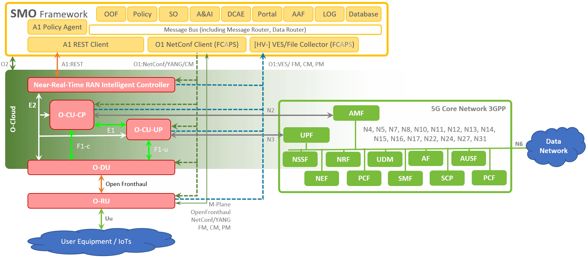

.. This work is licensed under a Creative Commons Attribution 4.0 International License.
.. SPDX-License-Identifier: CC-BY-4.0
.. Copyright (C) 2019 highstreet technologies and others

OAM Operation and Maintenance Overview
======================================

The O-RAN SC OAM project provides administrative and operator
functions for O-RAN components, such as Near-Realtime-RAN-Inelegant-Controller,
O-RAN Centralized Unit, O-RAN Distributed Unit and O-RAN Radio Unit. 

The project follows the specifications for the `O1 interface <https://www.o-ran.org/specifications>`_ 
as provided by O-RAN Working Group 1 (new 10).

The O-RAN-SC OAM project adds features and functions to the OpenDaylight-based ONAP
controller 'CCSDK/SDNC'. It is built on the Common Controller Framework
to control and to manage O-RAN ManagedElements and O-RAN ManagedFunctions. 

   SDN-R in ONAP

Project Resources
-----------------
The project uses the following Linux Foundation resources:

* The source code is maintained in this Gerrit:
    `<https://gerrit.o-ran-sc.org/r/admin/repos/oam>`_

* The build (CI) jobs are in this Jenkins:
    `<https://jenkins.o-ran-sc.org/view/oam/>`_

* Issues are tracked in this Jira:
    `<https://jira.o-ran-sc.org/projects/OAM/>`_

* Project information is available in this Wiki:
    `<https://wiki.o-ran-sc.org/display/OAM/Operations+and+Maintenance>`_

Scope
-----

According to the `O-RAN-OAM-Architecture document <https://www.o-ran.org/specifications>`_ 
all ManagedElements (ME) (near-real-time-RIC, O-CU-CP, O-CU-UP, O-DU and O-RU) 
implement the O1-interface.

The O-RAN-OAM-interface specification defines

- a NetConf-Server for Configuration Management (CM) and
- a http-client for Fault Management (FM), Performance Management (PM) and other 
  events on each Management-Service-Provider (MnS-Provider) running on the 
  ManagedElement.

THe O-RAN-SC-OAM project provides reference implementation according to the 
O-RAN OAM documents. In addition it provides a lightweight MnS-Consumer for 
development and module test purposes. The assumption is that the projects 
for the ManagedElements can concentrate on the more important user-plane.

Each project requires its own OAM repository to address the specific needs 
of the ManagedFunction.

The following O-RAN specifications are considered during implementations:

+------------------------------------------+---------------------------------------------------------+----------------------+
| Workgroup                                | Specification                                           | Version              |
+==========================================+=========================================================+======================+
| WG1 - Use Cases and Overall Architecture | O-RAN Architecture Description                          | 3.0 - November 2020  |
+                                          +---------------------------------------------------------+----------------------+
|                                          | O-RAN Operations and Maintenance Architecture           | 4.0 - November 2020  |
+                                          +---------------------------------------------------------+----------------------+
|                                          | O-RAN Operations and Maintenance Interface              | 4.0 - November 2020  |
+                                          +---------------------------------------------------------+----------------------+
|                                          | O-RAN Information Model and Data Models Specification   | November 2020        |
+------------------------------------------+---------------------------------------------------------+----------------------+
| WG4 - The Open Fronthaul Interfaces      | O-RAN Open Fronthaul Conformance Test Specification     | 2.00 - November 2020 |
+                                          +---------------------------------------------------------+----------------------+
|                                          | O-RAN Management Plane Specification                    | 5.0 - November 2020  |
+                                          +---------------------------------------------------------+----------------------+
|                                          | O-RAN Management Plane Specification - YANG Models      | 5.0 - November 2020  |
+------------------------------------------+---------------------------------------------------------+----------------------+
| TIFG - Test & Integration Focus Group    | O-RAN End-to-End System Testing Framework Specification | 1.0 - July 2020      |
+------------------------------------------+---------------------------------------------------------+----------------------+
