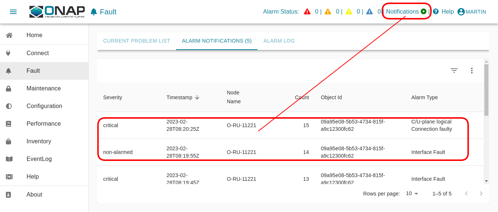

# O-RU Controller

This documents describes the deployment of an O-RU Controller which could be used 
as component for O-DU and/or SMO implementations. 

## Prerequisites

### Operating (HOST) System

```
$ cat /etc/os-release | grep PRETTY_NAME
PRETTY_NAME="Ubuntu 22.04.2 LTS"
```

### Docker

```
$ docker --version
Docker version 23.0.1, build a5ee5b1
```
Please follow the required docker daemon configuration as documented in the following README.md:
- [./smo/common/docker/README.md](./smo/common/docker/README.md)

### Docker Compose

```
$ docker-compose version
Docker Compose version v2.16.0
```

### GIT

```
$ git --version
git version 2.34.1
```

### Python

```
$ python3 --version
Python 3.10.6

```
sudo apt install python3-pip
pip install jproperties
```

```
It is beneficial (but not mandatory) adding the following line add the
end of your ~/.bashrc file. I will suppress warnings when python script
do not verify self signed certificates for HTTPS communication.

```
export PYTHONWARNINGS="ignore:Unverified HTTPS request"
```

### ETC Host (DNS function)

Please modify the /etc/hosts of your system.

* \<your-system>: is the hostname of the system, where the browser is started

* \<deployment-system-ipv4>: is the IP address of the system where the solution will be deployed

For development purposes <your-system> and <deployment-system> may reference the same system.

```
$ cat /etc/hosts
127.0.0.1	               localhost
127.0.1.1	               <your-system>

# SMO OAM development system
<deployment-system-ipv4>                   smo.o-ran-sc.org
<deployment-system-ipv4>           gateway.smo.o-ran-sc.org
<deployment-system-ipv4>          identity.smo.o-ran-sc.org
<deployment-system-ipv4>          messages.smo.o-ran-sc.org
<deployment-system-ipv4> ves-collector.oam.smo.o-ran-sc.org
<deployment-system-ipv4>         odlux.oam.smo.o-ran-sc.org
<deployment-system-ipv4>    controller.oam.smo.o-ran-sc.org

```

## Bring Up Solution

The following commands should be invoked. More detailed can be found in the
next chapters.

```
docker-compose -f smo/common/docker-compose.yml up -d
python smo/common/identity/config.py
docker-compose -f smo/oam/docker-compose.yml up -d odlux controller
docker-compose -f network/docker-compose.yml up -d ntsim-ng-o-ru-fh-11221
python network/config.py
```

## Verification Solution

### Login into O-RU-Controller UI

    https://odlux.oam.smo.o-ran-sc.org

    User: admin // see .env file

    Password: Kp8bJ4SXszM0WXlhak3eHlcse2gAw84vaoGGmJvUy2U

In case of trouble, please update the commands with your customized '.env' file.

### Connection State of the simulated O-RU

In the O-RU Controller UI you should see the simulated O-RU connected as a kind of reference implementation.


### Alarm Notification of the simulated O-RU

In the O-RU Controller UI you should see the generated alarm notifications of the O-RU as a kind of reference implementation.



## Terminate solution

To stop all container please respect the following order

```
docker-compose -f network/docker-compose.yml down
docker-compose -f smo/oam/docker-compose.yml down
docker-compose -f smo/common/docker-compose.yml down
```
