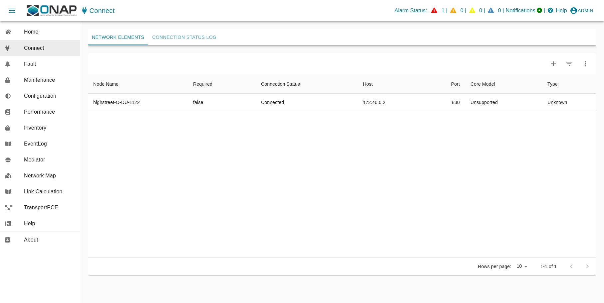
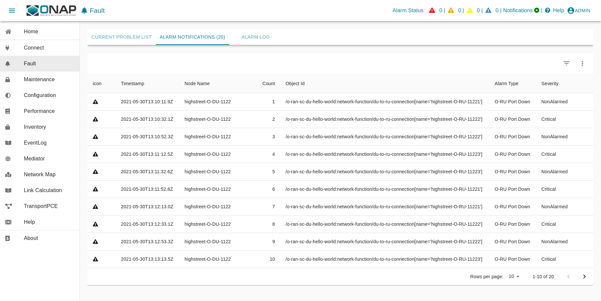

# Service Management and Orchestration (SMO)

This project focus on a docker-compose deployment solution for SMO/OAM Components.

## Introduction

With respect to Operation and Maintenance (OAM) the SMO implements the O1-interface consumers.
According to the O-RAN OAM Architecture and the O-RAN OAM Interface Specification,
the SMO implements a NETCONF Client for configuration and a HTTP/REST/VES server
for receiving all kind of events in VES format.

The O-RAN-SC OAM deployment contains an OpenDaylight based NETCONF client and an ONAP VES Collector. Kafka is used as massage router for communication between the components. The Keycloak implementation offers and Identity service, while traefik acts as reverse proxy to terminate all incoming https traffic. For storing data in a persistence way the implementation of the mariaDB project is used.

## SMO OAM Components

This docker-compose file starts a pre-configured, self-contained SDN-R solution
with the following components.

  * **Identity**
    ... representing an KeyCloak based identity service for centralized user
    management. Please note that the implementation does not support IPv6.
    Therefore, its own network is required called 'DMZ'.

  * **Controller** single node instance

    ... representing the NETCONF consumer on the Service Management and
    Orchestration framework (SMO) for O-RAN O1 interface and/or O-RAN OpenFronthaul Management Plane and/or other NETCONF/YANG schemas implemented by the OpenDaylight project.

  * **VES collector**

    ... representing the VES (REST) provider at SMO for all kind of events.

  * **Messages**
    ... representing SMO MessageRouter component, includes message-router

## Prerequisites

### Resources

The solution was tested on a VM with

- 4x Core
- 16 GBit RAM 
- 50 Gbit Storage

### Operating (HOST) System

```
$ cat /etc/os-release | grep PRETTY_NAME
PRETTY_NAME="Ubuntu 24.04.1 LTS"
```

### Docker

```
$ docker --version
Docker version 27.3.1, build ce12230
```
Please follow the required docker daemon configuration as documented in the following README.md:
- [./smo/common/docker/README.md](./smo/common/docker/README.md)

### Docker Compose

```
$ docker compose version
Docker Compose version v2.29.7
```

### GIT

```
$ git --version
git version 2.43.0
```

### Python

```
$ python3 --version
Python 3.12.3
```

A python parser package is required.
```
python3 -m venv .oam
source .oam/bin/activate
pip3 install jproperties
pip3 install jinja2
pip3 install requests

# your system IP is required in .env files, please see explanations below
python3 ./adopt_to_environment.py -i <deployment-system-ipv4> 
```

It is beneficial (but not mandatory) adding the following line add the
end of your ~/.bashrc file. I will suppress warnings when python script
do not verify self signed certificates for HTTPS communication.

```
export PYTHONWARNINGS="ignore:Unverified HTTPS request"
```

### ETC Host (DNS function)

Please change in the different .env files the environment variable 'HOST_IP'
to the IP address of the system where you deploy the solution - search for 
'aaa.bbb.ccc.dd' and replace it. 


```
# replace xxx.yyy.zzz.www by your routable IP address
grep -arl --include=*\.env 'aaa.bbb.ccc.dd' * | while read -r file; do
    sed -i 's/aaa.bbb.ccc.dd/xxx.yyy.zzz.www/g' "$file"
done
``

Please modify the /etc/hosts of your system.

* \<your-system>: is the hostname of the system, where the browser is started

* \<deployment-system-ipv4>: is the IP address of the system where the solution will be deployed

For development purposes <your-system> and <deployment-system> may reference the same system.

```
$ cat /etc/hosts
127.0.0.1	               localhost
127.0.1.1	               10.20.35.165

# SMO OAM development system
<deployment-system-ipv4>                   smo.o-ran-sc.org
<deployment-system-ipv4>           gateway.smo.o-ran-sc.org
<deployment-system-ipv4>          identity.smo.o-ran-sc.org
<deployment-system-ipv4>          messages.smo.o-ran-sc.org
<deployment-system-ipv4>      kafka-bridge.smo.o-ran-sc.org
<deployment-system-ipv4>         odlux.oam.smo.o-ran-sc.org
<deployment-system-ipv4>         flows.oam.smo.o-ran-sc.org
<deployment-system-ipv4>         tests.oam.smo.o-ran-sc.org
<deployment-system-ipv4>    controller.dcn.smo.o-ran-sc.org
<deployment-system-ipv4> ves-collector.dcn.smo.o-ran-sc.org
```

## Usage

### Bring Up Solution

#### Short story

The following commands should be invoked. More detailed can be found in the
next chapters.

```bash
source .oam/bin/activate
docker compose -f smo/common/docker-compose.yaml up -d --wait

# optionally adjust the users.csv file to create new users
vim users.csv
# override authentication.json with the new users
python3 create_users.py users.csv -o smo/common/identity/authentication.json

python3 smo/common/identity/config.py

docker compose -f smo/oam/docker-compose.yaml up -d
docker compose -f smo/apps/docker-compose.yaml up -d

# the cpu load is low again, we can start a simulated network

docker compose -f network/docker-compose.yaml up -d
docker compose -f network/docker-compose.yaml restart pynts-o-du-o1
```

#### Check (adjust if required) environment variables

```
nano smo/common/.env
nano smo/oam/.env
nano network/.env
```

#### Startup solution

Please note that it is necessary to configure first the identity service,
before starting further docker images.

The several docker-compose yaml files must be started in the right order as listed below:

```
docker compose -f smo/common/docker-compose.yaml up -d
python smo/common/identity/config.py
```

The python script configure the users within the identity service (keycloak).
A system user (%USER) is also created with administration rights.


```
docker compose -f smo/oam/docker-compose.yaml up -d
```

Looking into the ONAP SDN-R logs will give you the startup procedure.

```
docker logs -f controller
```

If you see the login page (https://odlux.oam.smo.o-ran-sc.org) you are good to go and can start the (simulated) network.

```
docker compose -f network/docker-compose.yaml up -d
```

Usually the first ves:event gets lost. Please restart the O-DU docker container(s) to send a second ves:pnfRegistration.

```
docker compose -f network/docker-compose.yaml restart ntsim-ng-o-du-1122
python network/config.py
```

The python script configures the simulated O-DU and O-RU according to O-RAN hybrid architecture.

O-RU - NETCONF Call HOME and NETCONF notifications
O-DU - ves:pnfRegistration and ves:fault, ves:heartbeat



'True' indicated that the settings through SDN-R to the NETCONF server were
successful.

SDN-R reads the fault events from DMaaP and processes them.
Finally the fault events are visible in ODLUX.




### Log files and karaf console

#### ODL karaf.logs

```
docker exec -it controller tail -f /opt/opendaylight/data/log/karaf.log
```

#### ves-collector logs

```
docker logs -f ves-collector
```

### Customizing Solution

'.env' file contains customizing parameters

### Verification Solution

#### Access to SDN-R ODLUX

    https://odlux.oam.smo.o-ran-sc.org

    User: admin 

    Password: // see .env file

In case of trouble, please update the commands with your customized '.env' file.

#### Access to Node Red Flows

    https://flows.oam.smo.o-ran-sc.org

    User: admin 

    Password: // see .env file

In case of trouble, please update the commands with your customized '.env' file.

### Terminate solution

To stop all container please respect the following order

```
docker compose -f network/docker-compose.yaml down
docker compose -f smo/apps/docker-compose.yaml down
docker compose -f smo/oam/docker-compose.yaml down
docker compose -f smo/common/docker-compose.yaml down
```

### Cleanup

!!! be careful if other stopped containers are on the same system
```
docker system prune -a -f
```
### Troubleshooting

In most cases the .env setting do not fit to the environment and need to be
adjusted.

Please make sure that the network settings to not overlap with other networks.

The commands ...
```
docker ps -a
docker-compose ps
docker rm -f $(docker ps -aq)
