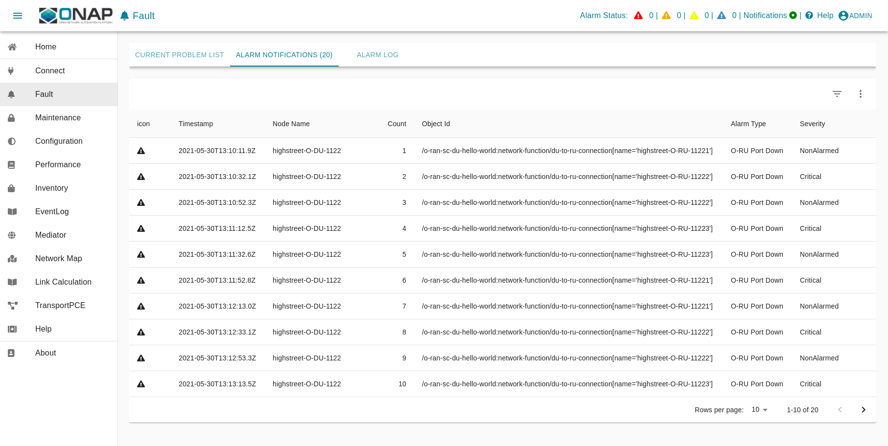
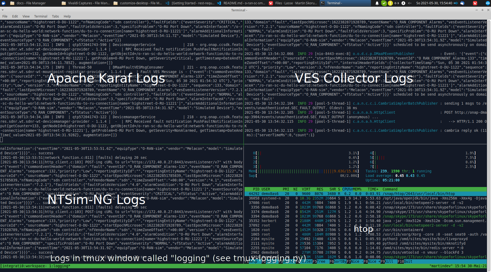

# Service Management and Orchestration (SMO)

##### Table of Contents
[Service Management and Orchestration (SMO)](#service-management-and-orchestration-smo)
- [Introduction](#introduction)
- [Overview](#overview)
- [Prerequisites](#prerequisites)
- [Usage](#usage)
  - [Bring Up Solution](#bring-up-solution)
  - [Log files and karaf console](#log-files-and-karaf-console)
  - [Customizing Solution](#customizing-solution)
  - [Verification Solution](#verification-solution)
    - [Access to SDN-R UX](#access-to-sdn-r-ux)
  - [Terminate solution](#terminate-solution)
  - [Cleanup](#cleanup)
  - [Troubleshooting](#troubleshooting)

## Introduction

With respect to OAM the SMO implements the O1-interface consumers. According to the O-RAN OAM Architecture and the O-RAN OAM Interface Specification, the SMO implements a NetConf Client for configuration and a HTTP/REST/VES server for receiving all kind of events in a VES format.

The setup contains an OpenDaylight based NetConf client and a VES Collector.

## Overview

This docker-compose file starts a pre-configured, self-contained SDN-R solution 
for developer test or demo purposes

  * **SDN-R** single node instance

    ... representing the NetConf consumer on the Service Management and 
    Orchestration framework (SMO) for the O1 interface based on 
    ODL-Silicon/ONAP-Istanbul

  * **VES collector**

    ... representing the VES (REST) provider at SMO for all kind of events.

  * **DMaaP**
    ... representing SMO DMaaP component, includes message-router

## Prerequisites

```
$ cat /etc/os-release | grep PRETTY_NAME
PRETTY_NAME="Ubuntu 20.04.2 LTS"

$ docker --version
Docker version 20.10.2, build 20.10.2-0ubuntu1~20.04.2

$ docker-compose --version
docker-compose version 1.29.1, build c34c88b2

$ git --version
git version 2.25.1

```

## Usage

### Bring Up Solution

#### Check (adjust if required) environment variables

```
nano .env
```

#### Startup solution

Please note that it is necessary to configure first the identity service,
before starting further docker images.

```
docker-compose up -d
```

The ntsim-ng configured for O1-interfaces nodes (e.g. O-DU) sends a ves:pnfRegistration event
every time the docker container is started.

Due to the fact that the first VES event gets "lost" please stop and start the 
ntsim-ng container **min 2 times**, AFTER you could log in to ODLUX (http://localhost:8181/odlux/index.html).


```
docker-compose restart ntsim-ng-o-du-1122

docker-compose restart ntsim-ng-o-du-1122
```


Once a new mount-point is created, it is possible to configure ntsim-ng, in a
way that automatically fault messaged are send to the ves-collector.

```
$ python config-ntsim-ngs.py 
Set highstreet-O-DU-1122 True
```

'True' indicated that the settings through SDN-R to the NETCONF server were
successful. 

SDN-R reads the fault events from DMaaP and processes them. 
Finally the fault events are visible in ODLUX.




### Log files and karaf console

#### ODL karaf.logs

```
docker exec -it sdnr tail -f /opt/opendaylight/data/log/karaf.log
```

#### karaf console access (karaf:karaf)

```
ssh karaf@localhost -p 8101
```

#### ves-collector logs

```
docker logs -f ves-collector
```

### Customizing Solution

'.env' file contains customizing parameters

### Verification Solution

#### Access to SDN-R ODLUX

##### Login into SDN-R

    http://<host_ip>:8181/odlux/index.html

    User: admin // see .env file
    
    Password: Kp8bJ4SXszM0WXlhak3eHlcse2gAw84vaoGGmJvUy2U

In case of trouble, please update the commands with your customized '.env' file.

### Terminate solution

To stop all container:

```
docker-compose down
```

re-start solution at any point in time with
```
docker-compose up -d
```

### Cleanup

!!! be careful if other stopped containers are on the same system
```
docker system prune -a -f
```
### Troubleshooting

In most cases the .env setting do not fit to the environment and need to be
adjusted.

Please make sure that the network settings to not overlap with other networks.

The commands ...
```
docker ps -a
docker-compose ps

## Prerequisites
# python3, tmux, libtmux
tmux new-session -n workspace -s integration

# within tmux session
python tmux-logging.py
```
... are your friends.

