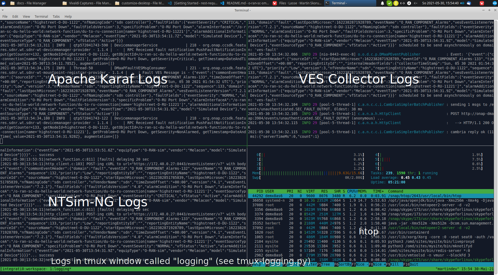

# Service Management and Orchestration (SMO)

##### Table of Contents
[Service Management and Orchestration (SMO)](#service-management-and-orchestration-smo)
- [Introduction](#introduction)
- [Overview](#overview)
- [Prerequisites](#prerequisites)
- [Usage](#usage)
  - [Bring Up Solution](#bring-up-solution)
  - [Log files and karaf console](#log-files-and-karaf-console)
  - [Customizing Solution](#customizing-solution)
  - [Verification Solution](#verification-solution)
    - [Access to SDN-R UX](#access-to-sdn-r-ux)
  - [Terminate solution](#terminate-solution)
  - [Cleanup](#cleanup)
  - [Troubleshooting](#troubleshooting)

## Introduction

With respect to OAM the SMO implements the O1-interface consumers. According to the O-RAN OAM Architecture and the O-RAN OAM Interface Specification, the SMO implements a NetConf Client for configuration and a HTTP/REST/VES server for receiving all kind of events in a VES format.

The setup contains an OpenDaylight based NetConf client and a VES Collector.

## Overview

This docker-compose file starts a pre-configured, self-contained SDN-R solution
for developer test or demo purposes

  * **Identity**
    ... representing an KeyCloak based identity service for centralized user
    management. Please note that the implementation does not support IPv6.
    Therefore, its own network is required called 'DMZ'.
    In this configuration the external https port is 8463.

  * **SDN-R** single node instance

    ... representing the NetConf consumer on the Service Management and
    Orchestration framework (SMO) for the O1 interface based on
    ODL-Silicon/ONAP-Istanbul
    SDN-R comes with is own web-portal the external port is 8463.

  * **VES collector**

    ... representing the VES (REST) provider at SMO for all kind of events. In this configuration the external https port is 8443.

  * **DMaaP**
    ... representing SMO DMaaP component, includes message-router

  * **ONAP-Policy**
    ... representing all the components of ONAP policy framework, in particular
    the policy-apex-pdp which executes the apex policies deployed in the framework
    when a certain event occurs.

  * **Non-RT-RIC**
    ... representing all the components of Non-RT-RIC, includes Non-RT-RIC Control Panel, Non-RT-RIC (Spring Cloud) Service Gateway, A1 Policy Management Services,
    Enrichment Data Coordinator, Non-RT-RIC App Catalogue, "HelloWorld" O-RU Fronthaul Recovery use-case, Near-RT RIC A1 Simulator etc.

## Prerequisites

```
$ cat /etc/os-release | grep PRETTY_NAME
PRETTY_NAME="Ubuntu 20.04.2 LTS"

$ docker --version
Docker version 20.10.7, build 20.10.7-0ubuntu1~20.04.2

$ docker-compose version
docker-compose version 1.29.1, build c34c88b2
docker-py version: 5.0.0
CPython version: 3.7.10
OpenSSL version: OpenSSL 1.1.0l  10 Sep 2019


$ git --version
git version 2.25.1

```
Please modify the /etc/hosts of your system.

* <your-system>: is the hostname of the system, where the browser is started

* <deployment-system-ipv4>: is the IP address of the system where the solution will be deployed

For development purposes <your-system> and <deployment-system> may reference the same system.

```
$ cat /etc/hosts
127.0.0.1	              localhost
127.0.1.1	              <your-system>
<deployment-system-ipv4>   sdnc-web <your-system>
<deployment-system-ipv4>   identity <your-system>
```

It is beneficial (but not mandatory) adding the following line add the
end of your ~/.bashrc file. I will suppress warnings when python script
do not verify self signed certificates for HTTPS communication.
```
export PYTHONWARNINGS="ignore:Unverified HTTPS request"
```

Please ensure that you download and copy the required 3GPP OpenAPIs for VES-stndDefined
message validation into the folder './solution/integration/smo/oam/ves-collector/externalRepo'.

Please follow the instructions in ./solution/integration/smo/oam/ves-collector/externalRepo/3gpp/rep/sa5/MnS/blob/Rel16/OpenAPI/README.md.

The following tree shows the successfully tested folder structure. It combines different versions of the schemas ('Rel16' and 'SA88-Rel16') using 3GPP branch names.

```
$ tree solution/integration/smo/oam/ves-collector/externalRepo/
solution/integration/smo/oam/ves-collector/externalRepo/
├── 3gpp
│   └── rep
│       └── sa5
│           └── MnS
│               └── blob
│                   ├── Rel16
│                   │   └── OpenAPI
│                   │       ├── 5gcNrm.yaml
│                   │       ├── PerfMeasJobCtrlMnS.yaml
│                   │       ├── README.md
│                   │       ├── comDefs.yaml
│                   │       ├── coslaNrm.yaml
│                   │       ├── faultMnS.yaml
│                   │       ├── fileDataReportingMnS.yaml
│                   │       ├── genericNrm.yaml
│                   │       ├── heartbeatNtf.yaml
│                   │       ├── nrNrm.yaml
│                   │       ├── perfMnS.yaml
│                   │       ├── provMnS.yaml
│                   │       ├── sliceNrm.yaml
│                   │       └── streamingDataMnS.yaml
│                   └── SA88-Rel16
│                       └── OpenAPI
│                           ├── 5gcNrm.yaml
│                           ├── PerDataFileReportMnS.yaml
│                           ├── PerMeasJobCtlMnS.yaml
│                           ├── PerThresMonMnS.yaml
│                           ├── PerfDataStreamingMnS.yaml
│                           ├── README.md
│                           ├── comDefs.yaml
│                           ├── coslaNrm.yaml
│                           ├── faultMnS.yaml
│                           ├── genericNrm.yaml
│                           ├── heartbeatNtf.yaml
│                           ├── nrNrm.yaml
│                           ├── provMnS.yaml
│                           ├── sliceNrm.yaml
│                           └── streamingDataMnS.yaml
```

## Expected Folder Structure

```
├── network
│   ├── .env
│   ├── config.py
│   ├── docker-compose.yml
│   │
│   ├── ntsim-ng-o-du
│   └── ntsim-ng-o-ru
└── smo
    ├── common
    │   ├── .env
    │   ├── docker-compose.yml
    │   │
    │   ├── dmaap
    │   ├── docker
    │   ├── identity
    │   ├── kafka
    │   ├── o-ran-sc-topology-service
    │   └── zookeeper
    ├── non-rt-ric
    │   ├── docker-compose.yml
    │   │
    │   ├── test
    │   ├── data
    │   └── config
    ├── oam
    │   ├── docker-compose.yml
    │   │
    │   ├── sdnc-web
    │   ├── sdnr
    │   └── ves-collector
    └── onap-policy
        ├── docker-compose.yml
        │
        ├── config
        └── wait_for_port.sh
```

## Usage

### Bring Up Solution

#### Check (adjust if required) environment variables

```
nano smo/common/.env
nano smo/non-rt-ric/.env
nano smo/oam/.env
nano network/.env
```

The tested configuration uses the following external https ports:

 * 8443 for the ves-collector
 * 8453 for web access to ODLUX (SDNC_WEB_PORT)
 * 8463 for the keyclock web administrator user interface.

#### Startup solution

Please note that it is necessary to configure first the identity service,
before starting further docker images.

The several docker-compose yml files must be started in the right order as listed below:

```
docker-compose -f smo/common/docker-compose.yml up -d
python smo/common/identity/config.py
```

The python script configure the users within the identity service (keycloak).
A system user (%USER) is also created with administration rights.

```
docker-compose -f smo/onap-policy/docker-compose.yml up -d
docker-compose -f smo/oam/docker-compose.yml up -d
docker-compose -f smo/non-rt-ric/docker-compose.yml up -d
```

In order to create/deploy the apex policy for O-RU closed loop recovery use case,
refer to the section named "Create/Deploy apex policy for O-RU & O-DU use case" in
this page:
https://wiki.o-ran-sc.org/pages/viewpage.action?pageId=35881325

Please note that the above instructions assume that the ToscaPolicy.json file
with default config needs to be deployed. However, when there is a need to update
the config (for example, to change the O-RU to O-DU mapping), a new ToscaPolicy.json
file needs to be created. Refer to the section named "Workflow for updating the policy config"
in this page:
https://wiki.o-ran-sc.org/pages/viewpage.action?pageId=35881325

Please wait about 2min until all the service are up and running.
If you see the login page (https://sdnc-web:8453) you are good to go and can start the (simulated) network.

### populate data into Non-RT-RIC

Full instruction on how to run Non-RT-RIC can be found in this page:
<https://wiki.o-ran-sc.org/display/RICNR/Release+D>

When containers in Non-RT-RIC are all up, by default, there is no data running inside. Folder `non-rt-ric/data/` contains several scripts to populate data into Non-RT-RIC for test & demo purpose.

```
bash prepareDmaapMsg.sh
```

script `prepareDmaapMsg.sh` sends messages to DMaaP message router, then Non-RT-RIC policy-agent service polls messages from DMaaP, and creates policy instances accordingly.

```
bash preparePmsData.sh
```

script `preparePmsData.sh` sends http requests to policy-agent service, and creates policy instances accordingly.

```
bash prepareEcsData.sh
```

script `prepareIcsData.sh` sends http requests to ics service, and creates data accordingly.

Afterwards, open webpage:
<http://localhost:8182/>
Now we should see some data in the page.

```
docker-compose -f network/docker-compose.yml up -d
```

Usually the first ves:event gets lost. Please restart the O-DU docker container(s) to send a second ves:pnfRegistration.

```
docker-compose -f network/docker-compose.yml restart ntsim-ng-o-du-1122
python network/config.py
```

The python script configures the simulated O-DU and O-RU according to O-RAN hybrid architecture.

O-DU - NETCONF Call HOME and NETCONF notifications
O-RU - ves:pnfRegistration and ves:fault, ves:heartbeat


'True' indicated that the settings through SDN-R to the NETCONF server were
successful.

SDN-R reads the fault events from DMaaP and processes them.
Finally the fault events are visible in ODLUX.


### Log files and karaf console

#### ODL karaf.logs

```
docker exec -it sdnr tail -f /opt/opendaylight/data/log/karaf.log
```

#### karaf console access (karaf:karaf)

```
ssh karaf@localhost -p 8101
```

#### ves-collector logs

```
docker logs -f ves-collector
```

#### onap-policy apex logs

```
docker logs policy-apex-pdp
```

#### Non-RT-RIC logs

```
docker logs policy-agent
docker logs oru-app
docker logs ecs
```

### Customizing Solution

'.env' file contains customizing parameters

### Verification Solution

#### Access to SDN-R ODLUX

##### Login into SDN-R

    https://sdnc-web:8453

    User: admin // see .env file

    Password: Kp8bJ4SXszM0WXlhak3eHlcse2gAw84vaoGGmJvUy2U

In case of trouble, please update the commands with your customized '.env' file.

#### Access to Topology Service

```
curl -u admin:admin http://localhost:18181/rests/data/network-topology:network-topology/topology=topology-netconf/node=o-ran-sc-topology-service/yang-ext:mount/tapi-common:context/tapi-topology:topology-context
```

#### Access to Wireshark

```
  http://localhost:3000
```

Select the interfaces you would like to capture.
As first guess, please select the bridge interfaces.
### Terminate solution

To stop all container please respect the following order

```
docker-compose -f network/docker-compose.yml down
docker-compose -f smo/oam/docker-compose.yml down
docker-compose -f smo/onap-policy/docker-compose.yml down
docker-compose -f smo/non-rt-ric/docker-compose.yml down
docker-compose -f smo/common/docker-compose.yml down
```

### Cleanup

!!! be careful if other stopped containers are on the same system
```
docker system prune -a -f
```
### Troubleshooting

In most cases the .env setting do not fit to the environment and need to be
adjusted.

Please make sure that the network settings to not overlap with other networks.

The commands ...
```
docker ps -a
docker-compose ps

## Prerequisites
# python3, tmux, libtmux
tmux new-session -n workspace -s integration

# within tmux session
python tmux-logging.py
```
... are your friends.

